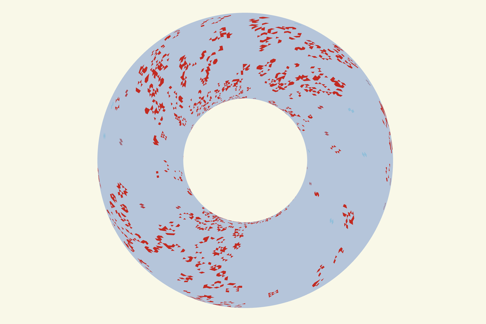
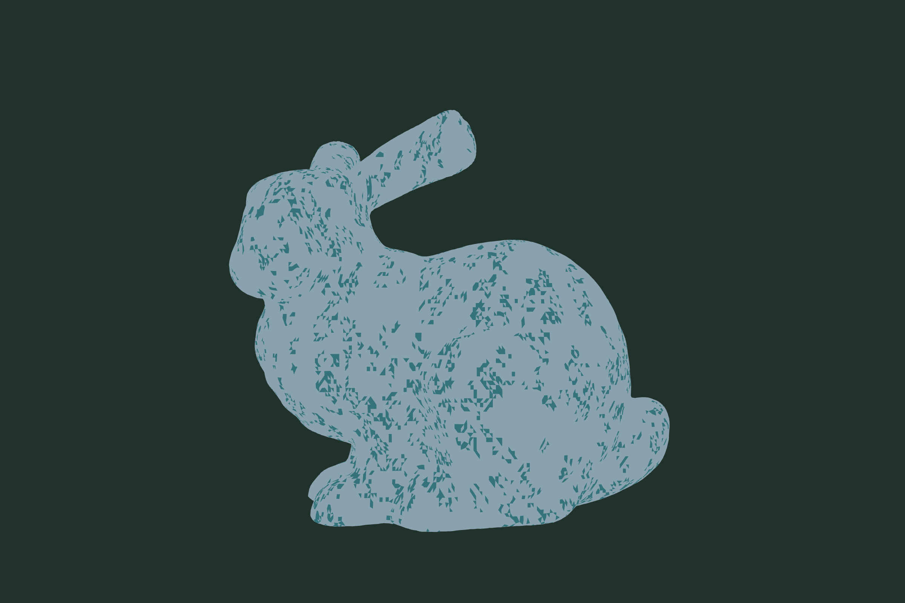

# Mesh of Life

**Conway's Game of Life running on the faces of a 3D mesh.**

Every triangle in the mesh is one cell. Neighbors are determined by shared edges
(or shared vertices), so Life evolves across the surface of spheres, tori,
Klein bottles, the Stanford Bunny, and any model you drag in.



## Features

- **Shareable URLs** — the mesh, detail, and rule are encoded in the query
  string (e.g. `?p=kb&d=6&r=08.0C`).
- **56 parametric surfaces** — Klein bottle, Möbius strip, figure-8 knot,
  Boy's surface, and more, all equal-area reparameterized for even cell sizes.
- **Built-in primitives & test models** — icosahedron, geodesic sphere, torus,
  box, cone, paraboloid, plus the Utah Teapot, Stanford Bunny, Suzanne, and Cow.
- **Import your own** — drag & drop or choose `.glb`, `.gltf`, `.obj`, `.stl`,
  `.ply`, or `.fbx` files.
- **Full rule support** — any `B/S` rule, a preset dropdown (HighLife, Day &
  Night, Seeds, Maze, …), and an interactive birth/survival grid.
- **Image & QR decals** — stamp an image (or a generated QR code) onto the mesh
  by luminance threshold, with spherical or planar projection, live preview, and
  interactive scale/rotate/offset placement.
- **GPU simulation** — a WebGL2 compute-style engine with an automatic CPU fallback.
  Face picking is GPU-based too, so hover andaint stay fast even at a million faces.

## Screenshots

| Parametric surface | Test model (Stanford Bunny) |
| --- | --- |
|  |  |

| QR code decal | Image decal (smiley) |
| --- | --- |
|  |  |

## Getting started

The app is plain ES modules, so it must be served over HTTP (not opened as a
`file://` URL). Any static server works:

```bash
# from the repo root
python3 -m http.server 8080
```

Then open <http://localhost:8080>.

### Requirements

- A modern browser with **WebGL2**. The GPU engine additionally needs
  `EXT_color_buffer_float`; if it's unavailable the app automatically falls back
  to the CPU engine. Append `?cpu=1` to force the CPU engine.
